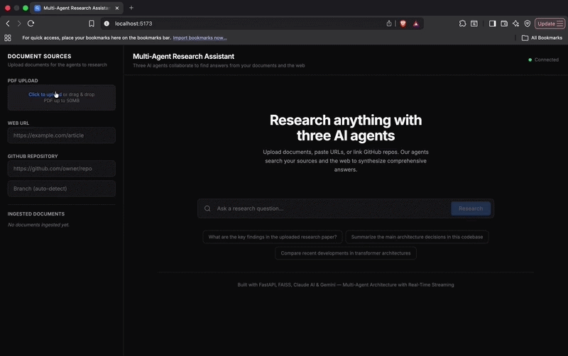

# 🔬 Multi-Agent Research Assistant

A multi-agent AI system where three specialized agents collaborate to answer research questions from your documents, the web, and GitHub repositories — delivering synthesized, cited answers in real time.



---

## 🧠 How It Works

Three AI agents work together, orchestrated in two phases — the Retriever runs
first so its findings can **ground** the Web Researcher's search queries:

```
User Query
    │
    ▼
┌──────────────┐
│ Orchestrator │
└──────┬───────┘
       │
       ▼  Phase 1a
┌──────────────┐
│  Retriever   │  searches your documents (Qdrant)
└──────┬───────┘
       │ findings ground the web search
       ▼  Phase 1b
┌──────────────┐
│Web Researcher│  searches the web (Tavily / DuckDuckGo)
└──────┬───────┘
       │
       ▼  Phase 2
┌──────────────┐
│ Synthesizer  │  merges, dedupes, cites — streamed live
└──────┬───────┘
       ▼
Final Answer with Citations
```

| Agent | What It Does |
|-------|-------------|
| 🔍 **Retriever** | Searches your uploaded documents using Qdrant vector similarity, then uses an LLM to extract and summarize relevant passages |
| 🌐 **Web Researcher** | Generates smart search queries from your question, searches the web via Tavily (or DuckDuckGo), scrapes top results, and summarizes findings |
| ✍️ **Synthesizer** | Combines findings from both agents, resolves conflicts, deduplicates info, and produces a final cited answer streamed in real time |

---

## ⚙️ Tech Stack

| Layer | Technology |
|-------|-----------|
| **Backend** | FastAPI + Uvicorn with SSE streaming |
| **Frontend** | React 19 + Vite + Tailwind CSS |
| **LLM** | Claude (primary) + Gemini (fallback) |
| **Vector DB** | Qdrant (embedded) |
| **Embeddings** | sentence-transformers (all-MiniLM-L6-v2) |
| **Web Search** | Tavily (primary) + DuckDuckGo (fallback) |
| **Observability** | Langfuse tracing |
| **Evaluation** | RAGAS |

---

## 🚀 Quick Start

**Prerequisites:** Python 3.11+ and Node.js 18+.

### 1. Clone and configure

```bash
git clone https://github.com/ne-on-7/multi-agent-research-assistant.git
cd multi-agent-research-assistant
cp .env.example .env
```

Add your API keys to `.env`:

```env
ANTHROPIC_API_KEY=sk-ant-xxxxx
GOOGLE_API_KEY=AIzaxxxxx
```

### 2. Run the app

**Option A — Using the start script (recommended):**

```bash
chmod +x start.sh
./start.sh
```

This installs dependencies, starts the FastAPI backend on `http://localhost:8000`, and the React frontend on `http://localhost:5173`.

---

## 📖 Usage

1. 📄 **Upload documents** — Use the sidebar to upload PDFs, paste web URLs, or link GitHub repos
2. ❓ **Ask a question** — Type your research question in the main input
3. 👀 **Watch agents work** — See each agent's status and output stream in real time
4. ✅ **Get your answer** — Receive a synthesized answer with numbered citations

---

## 🔍 Search Providers

Web search runs behind a pluggable `SearchProvider` interface
([`services/search_provider.py`](services/search_provider.py)):

- **Tavily** (primary) — set `TAVILY_API_KEY` to use Tavily's ranked, LLM-ready
  results. Because Tavily returns clean page content, the Web Researcher skips its
  own HTML scrape, making research faster and higher-signal.
- **DuckDuckGo** (fallback) — used automatically when no Tavily key is set, so the
  app works with zero search configuration.

Swapping providers is just an environment variable — no code changes.

---

## 📊 Observability & Evaluation

**Tracing (Langfuse).** Built on the Langfuse Python SDK v4. When
`LANGFUSE_PUBLIC_KEY` / `LANGFUSE_SECRET_KEY` are set, every `/api/query` is traced
end-to-end: one trace per request, a span per agent (Retriever / Web Researcher /
Synthesizer), and a generation per LLM call capturing **model name + token usage**
(which powers Langfuse's automatic cost tracking). Tracing is fully optional — with
no keys it is a no-op and the app runs unchanged. See
[`services/observability.py`](services/observability.py).

**Evaluation (RAGAS).** An offline harness scores answer quality on a fixed
question set — *faithfulness, answer relevancy, context precision, context recall* —
using Claude as the judge LLM and the app's own embeddings:

```bash
pip install -r requirements.txt -r requirements-eval.txt
python eval/run_eval.py
```

It runs the real pipeline against an isolated vector store, prints a metrics
table, writes `eval/results.json`, and logs scores to Langfuse when configured.
Details in [`eval/README.md`](eval/README.md).

---

## 🔌 API Endpoints

| Method | Endpoint | Description |
|--------|----------|-------------|
| `POST` | `/api/ingest/pdf` | Upload and ingest a PDF |
| `POST` | `/api/ingest/url` | Ingest content from a URL |
| `POST` | `/api/ingest/github` | Ingest a GitHub repository |
| `GET` | `/api/documents` | List ingested documents |
| `DELETE` | `/api/documents` | Clear all documents |
| `POST` | `/api/query` | Research query (SSE stream) |
| `GET` | `/api/health` | Health check |

---

## 📁 Project Structure

```
multi-agent-research-assistant/
├── api/                        # FastAPI application
│   ├── main.py                 # App init & middleware
│   ├── routes/                 # API endpoints
│   ├── dependencies.py         # Dependency injection
│   └── models/                 # Pydantic schemas
├── agents/                     # AI agent implementations
│   ├── base.py                 # Base agent class
│   ├── retriever.py            # Document search agent
│   ├── synthesizer.py          # Answer synthesis agent
│   └── web_researcher.py       # Web search agent
├── services/                   # Core business logic
│   ├── orchestrator.py         # Multi-agent coordination
│   ├── llm_provider.py         # LLM abstraction (Claude/Gemini)
│   ├── search_provider.py      # Pluggable web search (Tavily/DuckDuckGo)
│   ├── observability.py        # Langfuse tracing (optional)
│   ├── vector_store.py         # Qdrant vector store
│   ├── embeddings.py           # Embedding service
│   └── document_processor.py   # PDF/URL/GitHub processing
├── eval/                       # RAGAS evaluation harness
│   ├── run_eval.py             # Runs the pipeline + scores with RAGAS
│   ├── dataset.json            # Curated question/ground-truth set
│   └── fixtures/               # Source docs ingested for eval
├── config/                     # Configuration
│   └── settings.py             # Pydantic settings
├── frontend/                   # React + Vite SPA
│   ├── src/components/         # UI components
│   ├── src/hooks/              # Custom React hooks
│   └── vite.config.js          # Vite config
├── requirements.txt
├── requirements-eval.txt       # Eval-only dependencies
├── start.sh                    # Dev startup script
└── .env.example                # Environment variable template
```

---

## 🔑 Environment Variables

| Variable | Description | Default |
|----------|-------------|---------|
| `ANTHROPIC_API_KEY` | Your Anthropic API key | — |
| `GOOGLE_API_KEY` | Your Google AI API key | — |
| `LLM_PRIMARY` | Primary LLM provider | `claude` |
| `LLM_FALLBACK` | Fallback LLM provider | `gemini` |
| `CLAUDE_MODEL` | Claude model to use | `claude-sonnet-4-6` |
| `GEMINI_MODEL` | Gemini model to use | `gemini-2.0-flash` |
| `EMBEDDING_MODEL` | Sentence transformer model | `all-MiniLM-L6-v2` |
| `QDRANT_URL` | Qdrant server URL (server mode only) | `http://localhost:6333` |
| `QDRANT_API_KEY` | Qdrant API key (optional) | — |
| `TAVILY_API_KEY` | Tavily search key — falls back to DuckDuckGo if unset | — |
| `LANGFUSE_PUBLIC_KEY` | Langfuse public key (enables tracing) | — |
| `LANGFUSE_SECRET_KEY` | Langfuse secret key (enables tracing) | — |
| `LANGFUSE_BASE_URL` | Langfuse host (US: `https://us.cloud.langfuse.com`) | `https://cloud.langfuse.com` |
